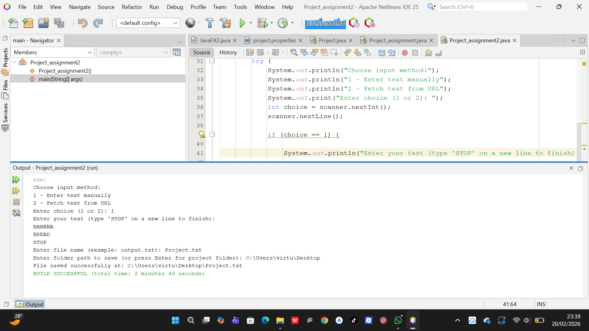
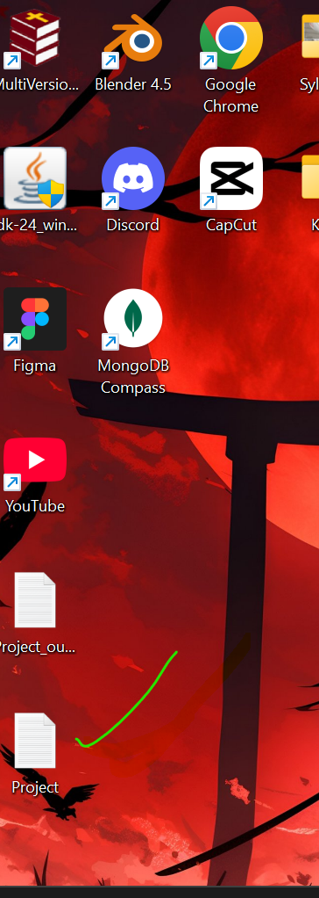

User Guide:
1. Overview
This project is a Java application that allows you to generate .txt files by either typing text manually into the console or pulling data directly from a website URL.

2. Running the Program in NetBeans
 * Open the project in NetBeans.
 * Locate TextFileCreator.java in the Projects window.
 * Right-click the file and select Run File, or press Shift + F6.
 * All interaction will take place in the Output tab at the bottom of the NetBeans interface.
   
3. Input Methods
Once the program starts, you must choose one of two ways to generate your text:
| Method | Instruction |
|---|---|
| 1 - Manual | Type your text line by line. To stop and save, type END on a new line and press Enter. |
| 2 - URL Fetch | Paste a full URL. The program will download the source text of that page.

4. Saving Your File
After the text is captured, the program will ask for two pieces of information:
 * File Name: Enter the name you want (e.g., mydata.txt).
 * Folder Path: * To save in a specific folder, paste the directory path (e.g., C:\Users\Documents).

5. Troubleshooting
 * Invalid Choice: If you enter a number other than 1 or 2, the program will terminate.
 * URL Errors: Ensure the URL starts with http:// or https://.
 * File Errors: If you provide a folder path that does not exist or is "read-only," the program will display a "File path not found" error.

Screenshots: The code running:

 
 
 
The output:

 
 
 
